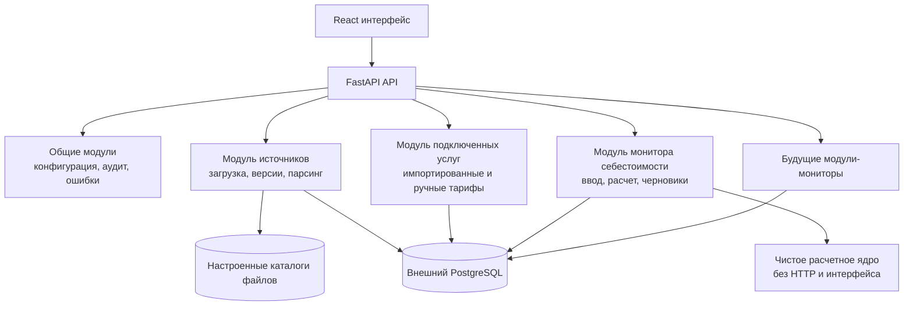

# Монитор расчета себестоимости: архитектурный и UX-план

Статус: **архитектурное решение v1; реализован локальный MVP**.

Этот документ фиксирует выбранное направление и не меняет правила расчета из
[business-logic baseline](cost-monitor-business-logic.md). В локальном MVP
работают FastAPI, React/TypeScript, файловые источники и JSON-хранилище для
разработки; перед производственным запуском JSON-адаптер заменяется внешним
PostgreSQL-адаптером.

## 1. Рекомендованное направление

Выбрать **FastAPI + React/TypeScript** в виде модульного монолита.

- **FastAPI** — API, загрузка и парсинг источников, расчет, сохранение черновиков, настройки путей и будущая авторизация.
- **React/TypeScript** — интерактивный интерфейс расчета, экран «Источники», «Подключённые услуги» и параметры.
- **PostgreSQL как внешний сервис** — долговременное хранение служебных данных. В приложении не используется встроенная файловая БД (например, SQLite).
- **Файловое хранилище** — настроенные рабочие директории источников; туда интерфейс загружает новые версии файлов. Позднее оно может быть заменено сетевым или объектным хранилищем без изменения расчетного модуля.

FastAPI предпочтительнее Django для первого этапа: приложение — прежде всего интерактивный расчетный интерфейс с четким API, без готового кабинета пользователей и административного сайта. Его модульные роутеры, типизированные модели и автоматическая OpenAPI-документация подходят для отделения расчетного ядра от интерфейса. Django остается допустимой альтернативой, если позже приоритетом станут встроенная админка, сложные серверные формы и управление пользователями.

## 2. Почему нельзя опираться только на кэш и cookies

Требование «введенные данные остаются после обновления или закрытия страницы» не должно зависеть только от кэша браузера:

- кэш может быть очищен политиками браузера или пользователем;
- cookie хранит только небольшой идентификатор, а не полноценный расчет;
- `localStorage` переживает перезапуск браузера, но принадлежит одному браузеру и не подходит для файлов, настроек источников и общих ручных тарифов.

### Выбранная модель сохранения

1. Форма расчета автосохраняется в `localStorage` после изменения — это мгновенное восстановление страницы при обновлении/закрытии браузера.
2. Тот же черновик с небольшой задержкой сохраняется на сервере в PostgreSQL. Это защита от очистки браузера, сбоя устройства и обновления приложения.
3. Браузер хранит в защищенной first-party cookie только случайный идентификатор черновика. Cookie не является авторизацией и не содержит расчетных данных.
4. Все общие сущности — версии источников, распарсенные таблицы, ручные услуги, пути источников и снимки расчетов — хранятся на сервере с первого этапа.
5. Отдельный кэш (Redis и т. п.) на первом этапе не нужен. Его можно добавить позже только для ускорения тяжелого парсинга; он никогда не является единственным местом хранения данных.

Пока нет авторизации, черновик привязан к конкретному браузеру. При появлении авторизации его владельцем станет пользователь, а черновики можно будет открывать на разных устройствах.

Локальный MVP уже помечает расчеты номером активной версии данных, который
увеличивается при успешном обновлении источников или изменении ручной услуги.
Это легкий операционный след; неизменяемые исторические снимки источников будут
добавлены вместе с внешним PostgreSQL.

## 3. Чистая расширяемая архитектура

Правило модульности: новый монитор получает собственные API-роуты, схемы, расчетное ядро и экран, но переиспользует общие модули источников, конфигурации, файлов и будущих прав доступа. Это дает расширяемость без раннего разделения на множество независимых сервисов.

## 4. Границы модулей первого монитора

| Модуль | Ответственность | Не делает |
|---|---|---|
| Источники | Пути, прием файлов, версии, запуск парсинга, просмотр сырого и распарсенного содержимого | Не рассчитывает себестоимость |
| Подключённые услуги | Единый справочник ЦРТ, признак «из файла» / «добавлено вручную», конфликты ключей | Не удаляет ручную строку при обновлении файла |
| Расчет себестоимости | Плечи, функциональные ручки, детализация, расчет и итоги М1/М2/М3 | Не меняет M-правила без отдельного решения |
| Черновики | Автосохранение и восстановление формы | Не подменяет общие тарифы/источники |
| Параметры | Пути источников, маски файлов, типы парсеров и прочая конфигурация | Не хранит секреты в браузере |

## 5. UX-направление

Ориентир — предоставленный референс: нейтральный светлый фон, аккуратная центральная рабочая область, белые карточки с мягкой тенью, спокойный голубой акцент и заметные, но не агрессивные переключатели.

### Базовые правила

- Фон: очень светлый холодно-нейтральный; рабочие карточки — белые.
- Основной акцент: умеренный голубой; для выбранного состояния — светло-голубая подложка и четкая тонкая рамка.
- Скругления 10–12 px, тонкие серо-голубые границы, тени только для отделения карточки от фона.
- Понятные русские названия вместо технических: «Источники», «Подключённые услуги», «Параметры», «Новый расчет».
- Цвет не должен быть единственным носителем смысла: у статуса есть текст и пиктограмма.
- Сложные расчеты показываются по запросу пользователя; компактный вид оставляет плечи и итоговые значения.

### Экраны

| Экран | Содержимое |
|---|---|
| Расчет | Карточка с функциональными ручками, список плеч без ограничения числа строк, кнопка «Добавить плечо», итог М1/М2/М3, переключатель «Показать детализацию» |
| Источники | Карточки/таблица источников, путь, последняя версия, статус, действия «Просмотреть», «Загрузить файл», «Обновить»; просмотр исходных строк с выбором листа книги и отдельный просмотр результата парсинга |
| Подключённые услуги | Поиск и фильтры, единый список тарифов, метка происхождения, добавление ручной строки, заметный конфликт импортированной и ручной записи |
| Параметры | Настройка путей, масок файлов и безопасных параметров парсинга; изменения подтверждаются и журналируются |

## 6. Подготовка к авторизации

Авторизацию пока не реализовывать. Но с первого этапа предусмотреть:

- API без предположения, что пользователь всегда анонимный;
- поле автора/инициатора операции, допускающее пустое значение до внедрения пользователей;
- журнал загрузки источников, ручных изменений тарифов и обновлений;
- единый слой проверки прав, в котором пока действует режим «доступ разрешен», а позже появятся роли (например, просмотр, редактирование тарифов, настройка источников).

## 7. Что остается решением на следующем этапе

1. Будет ли PostgreSQL предоставляться корпоративной инфраструктурой, либо требуется согласовать другой внешний сервер хранения?
2. Нужен ли общий список сохраненных расчетов уже в первой версии или достаточно личного черновика браузера?
3. Какие роли и ограничения должны появиться вместе с авторизацией?
4. Какой срок хранения старых файлов источников и снимков расчетов требуется бизнесу?

Эти вопросы не блокируют локальный MVP, но должны быть закрыты до
производственного развертывания.
