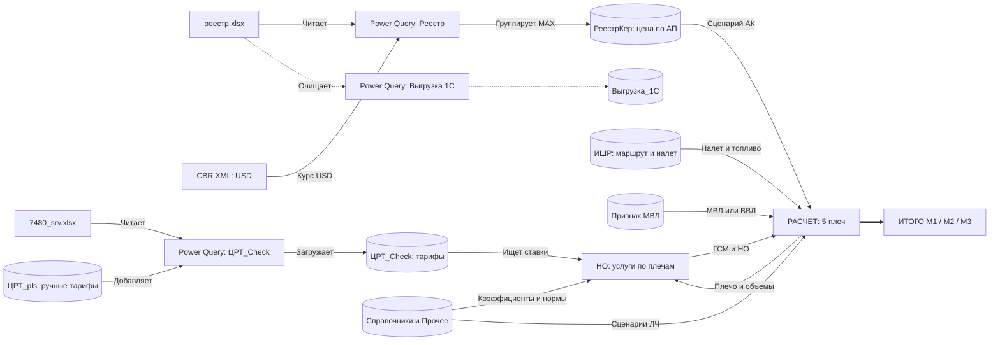
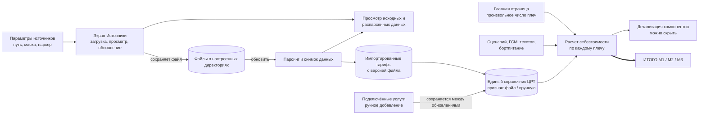

# Карта зависимостей монитора расчета себестоимости

Статус: схема отражает подтвержденные связи из M-кода Power Query, Query Tables и Excel-формул. Пунктиром отмечены неиспользуемые/проблемные ветки.

## Целевой веб-поток

Здесь «единый справочник ЦРТ» — представление распарсенных и ручных строк, а не отдельный лист `ЦРТ+`. При совпадении ключа ручная строка сохраняется и помечается конфликтом; в режиме совместимости расчет выбирает импортированную строку, поскольку она стоит первой.

## Подтвержденные особенности

- M-код Power Query — эталон преобразований для текущего переноса. Его поведение и порядок результатов воспроизводятся без новых интерпретаций.
- `ЦРТ_pls` добавляется в конец результирующего набора. По утвержденному назначению таблица содержит только отсутствующие в выгрузках услуги/аэропорты и не используется как override.
- `Выгрузка_1С` загружается как почти исходная распарсенная детализация керосина для анализа; прямых ссылок на нее в формулах расчета нет.
- Вспомогательные запросы `Запрос1` и `fnGetCurrencyRate` не загружаются в лист и не вызываются активными запросами.
- `ЦРТ_МВЛ` не включен в расчетный путь и содержит 240 сохраненных ошибок `#REF!`.

Для программной реализации используйте [business-logic baseline](cost-monitor-business-logic.md) и [архитектурный и UX-план](cost-monitor-architecture-plan.md).
